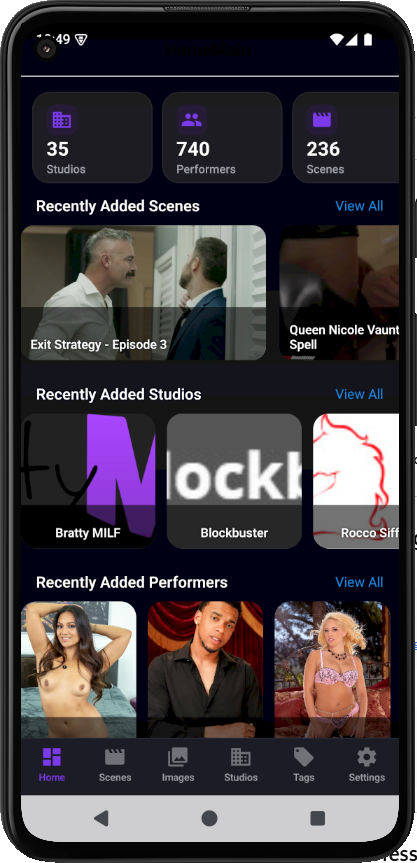
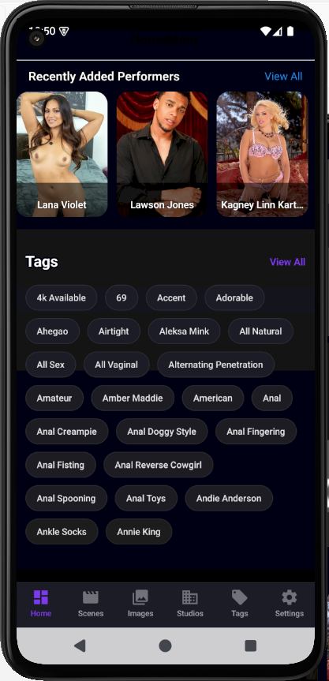

# Cento

**Cento** is an open-source Android app built as a modern mobile client for **Stash Server**.

It allows users to browse, explore, and play their Stash media library directly from their Android device with a clean and fast native interface.

---

## ✨ Features

- Connects to your self-hosted **Stash Server**
- Browse scenes, performers, studios, tags, and images
- Play scene videos directly inside the app
- Recent additions dashboard
- Smooth navigation with bottom tabs

---

## 📱 Platform

- **Android only**
- Built using **React Native**
- No Play Store dependency

---

## 🔧 Setup & Usage

1. Install the APK from the **Releases** section
2. Configure your Stash Server URL and API key
3. Start browsing your library

---

## 🔄 Updates

Cento checks for new versions on startup.  
When a new release is available, the app will notify you and allow you to download and install the update directly.

---

## 🛡 Privacy

Cento uses privacy-respecting analytics.

- Anonymous, app-scoped identifier (random GUID)
- No hardware/device identifiers
- No fingerprinting techniques
- No cross-app tracking
- No Advertising ID usage
- Analytics reset on reinstall
- No personal data collected
- All analytics data stays on our own server

---

## Screenshots

---

---

## 🐞 Current Known Issues

While Cento is stable for daily usage, a few minor issues are currently known:

- Some thumbnails may briefly show placeholders before loading
- Video playback may buffer on slower network connections
- UI performance may slightly vary on older Android devices
- Biometric prompt behavior may depend on device security configuration

> These are cosmetic or device-specific limitations and do not affect core functionality.

---

## 🚀 Future Updates & Improvements

Cento is actively evolving. Planned enhancements include:

### 🔐 Security & Authentication
- Improved lock system behavior
- Optional PIN / Pattern protection layer
- Smarter background lock handling
- Enhanced biometric UX

### 🎨 UI & Experience
- Refined glassmorphism effects
- Smoother animations & transitions
- Enhanced gradient themes
- Improved visual hierarchy

### 🔎 Browsing & Discovery
- Advanced filtering options
- Better sorting controls
- Persistent search states
- Faster list rendering

### 🎬 Media Handling
- Optimized thumbnail loading
- Improved video buffering logic
- Optional caching enhancements

### ⭐ Personalization
- Favorites / Watchlist system
- Recently viewed tracking
- Customizable UI preferences

---

## 💡 Project Status

Cento is under continuous improvement with a focus on:

✔ Performance  
✔ Visual Polish  
✔ Stability  
✔ Premium User Experience  

---

## 📄 License

This project is licensed under the **MIT License**.

You are free to use, modify, and distribute this software, provided that the original license and copyright notice are included.

---

## 🚧 Status

Cento is under active development.  
Features and UI may change over time.

---

## 🤝 Contributing

Issues, suggestions, and pull requests are welcome.

---

## ⚠ Disclaimer

This app is an **unofficial client** and is not affiliated with or endorsed by the Stash project.
